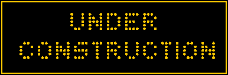

<h1 align="center">✨My simple neoVim configuration✨</h1>

   

## things to be done <o__0>
- [ ] Update nvim to 0.10
- [ ] Make terminal enable italic fonts in nvim editor colorscheme
- [ ] Fix tmux not loading italic fonts on Neovim
- [ ] Create a way to telescope (space + e) to delete selected buffer
- [ ] Use tab to alternate through marked pages and let tab navigation go to telescope
- [ ] Adjust autosurround ()
- [ ] Implement tags autosurround
- [ ] Improve cmp visual and usage
- [ ] Enhance LSP integration with Go and Python
- [ ] Check in Typecraft channel for better dotfile storage
- [ ] Adjust a way to load dotfiles better
- [ ] Implement undo tree>

## features to copy from astronvim e.e
- [ ] Telescope that shows all manuals
- [ ] Telescope that shows all git commits
- [ ] Telescope that shows all git branches
- [ ] Telescope that shows all git changes status
- [ ] Way to show git diff from last commit
- [ ] Yeet config for Go and Pythonor go and python